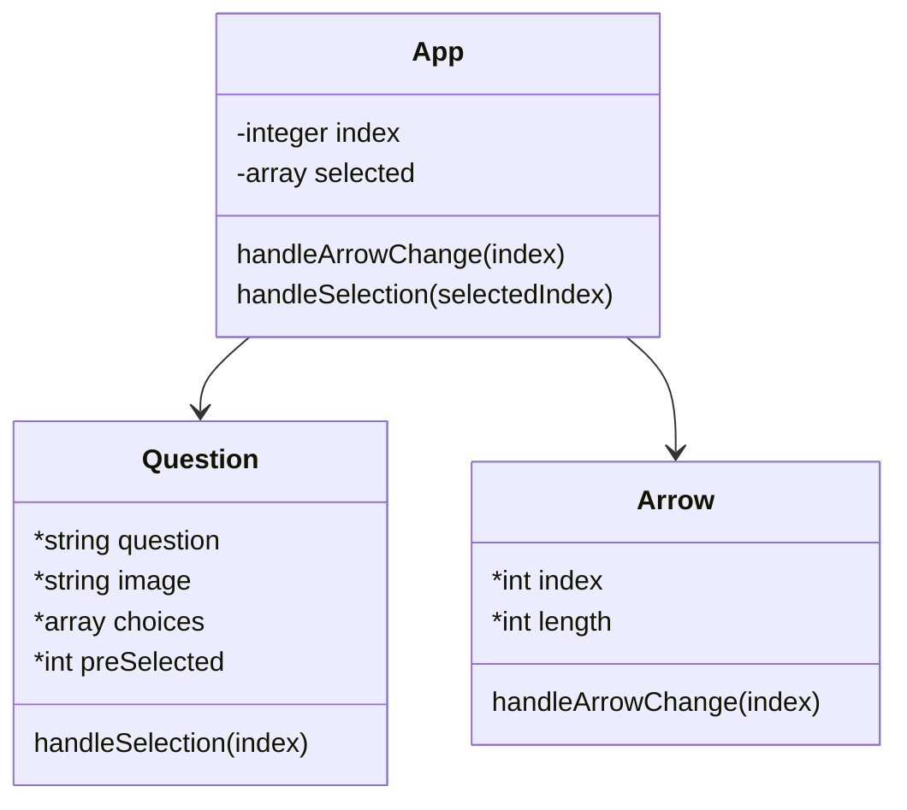

# React Questions

Example Of Building A Simple Quiz With React

```mermaid
classDiagram

App -->Question
App -->Arrow

class App{
    -integer index
    -array selected
    handleArrowChange(index)
    handleSelection(selectedIndex)
}

class Question{
    *string question
    *string image
    *array choices
    *int preSelected
    handleSelection(index)
}

class Arrow{
    *int index
    *int length
    handleArrowChange(index)
}

```